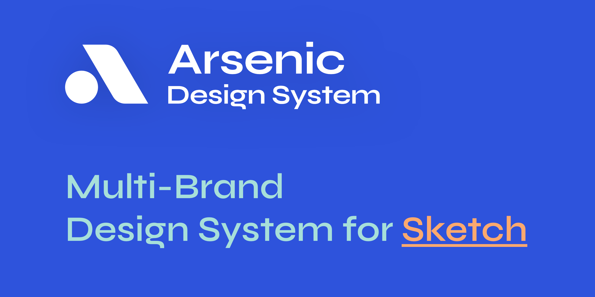

<a href="https://www.cohort.work/" target="_blank">
    
👉 cohort.work

</a>

Arsenic is atom based Multi-brand friendly Design system with standards.

Create UI projects much faster without creating them all over again everytime!

 
<i>Follow us around the web:</i>
  
    

